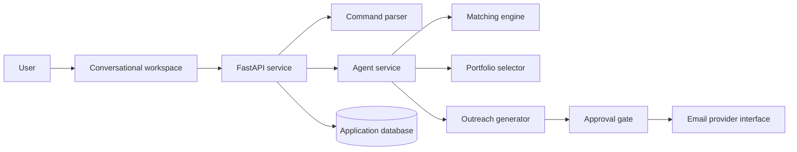

# ApplyPilot AI

### Turn job hunting into a conversation.

ApplyPilot AI is a full-stack conversational workspace for discovering international remote opportunities, understanding role fit, preparing tailored outreach, selecting relevant portfolio evidence, and tracking applications from discovery to reply.

> **Portfolio showcase:** The production source is maintained in a private repository. This public repository documents the product, engineering decisions, and verified demo behavior without distributing the implementation.

## Product experience

Instead of moving between job boards, notes, email drafts, and spreadsheets, a user can simply ask:

```text
Find international remote AI / RAG / Python work today
```

ApplyPilot responds with numbered opportunities, transparent approximate-fit explanations, important matching skills, gaps, remote constraints, and clear next actions.

The user can then write:

```text
apply 1, 2 and 4
```

For each selected role, the system:

1. Evaluates the requirements and company context
2. Selects the most relevant portfolio project
3. Drafts concise, role-specific outreach
4. Shows a complete preview
5. Requires explicit user approval
6. Simulates delivery in demo mode
7. Updates the application tracker

## Highlights

- Chat-first remote opportunity discovery
- Deterministic parsing for numbered commands—no LLM required
- Transparent, explainable fit scoring
- Context-aware portfolio project selection
- Personalized outreach with privacy-safe candidate defaults
- Mandatory approval before any send action
- Kanban application tracker with persistent state
- Responsive light and dark product UI
- Realistic, clearly labeled demo opportunities
- Provider-ready interfaces for future LLM, GitHub, and Gmail integrations

## Technology

| Layer | Stack |
| --- | --- |
| Product UI | Next.js, React, TypeScript, CSS |
| API | FastAPI, Python, Pydantic |
| Persistence | SQLAlchemy, SQLite |
| Quality | Pytest, ESLint, Next.js production build |
| Local delivery | PowerShell launcher, Docker Compose |

## Architecture



The architecture keeps deterministic product logic separate from AI-provider concerns. Search research, proposal generation, GitHub sync, and email delivery can each adopt a real provider without rewriting the core application workflow.

## Matching model

The approximate fit indicator is explainable rather than presented as scientific certainty:

- 40% required-skill overlap
- 20% preferred-skill overlap
- 15% portfolio evidence
- 10% work-type alignment
- 10% remote compatibility
- 5% experience-level fit

Every score includes visible match reasons and missing skills.

## Safety by design

- No automatic outreach without approval
- No fabricated experience, qualifications, projects, or metrics
- No passwords or API secrets in source
- No location or student-status disclosure unless required
- Demo opportunities and simulated email delivery are clearly marked
- No CAPTCHA bypassing or access-restriction circumvention

## Verified MVP workflow

The end-to-end demo supports:

1. Search for remote AI work
2. Receive eight ranked demo opportunities
3. Select roles by number
4. Generate application drafts
5. Select different project evidence based on role relevance
6. Review and approve each email
7. Simulate sending
8. See the tracker update

Quality checks completed:

- Backend automated tests: **4 passed**
- Frontend lint: **passed**
- Next.js production build: **passed**
- Live search and preparation workflow: **verified locally**

## Roadmap

- Real job-search and company-research providers
- GitHub OAuth and repository synchronization
- Gmail OAuth and verified recipient review
- Recruiter reply monitoring
- Browser-assisted application forms
- Scheduled opportunity searches
- Analytics and multi-user authentication

## Source access

The source code is intentionally private to protect the original implementation. Recruiters or collaborators can request a guided technical walkthrough or temporary review access directly from the author.

© 2026 Muhammad Anas. All rights reserved.

