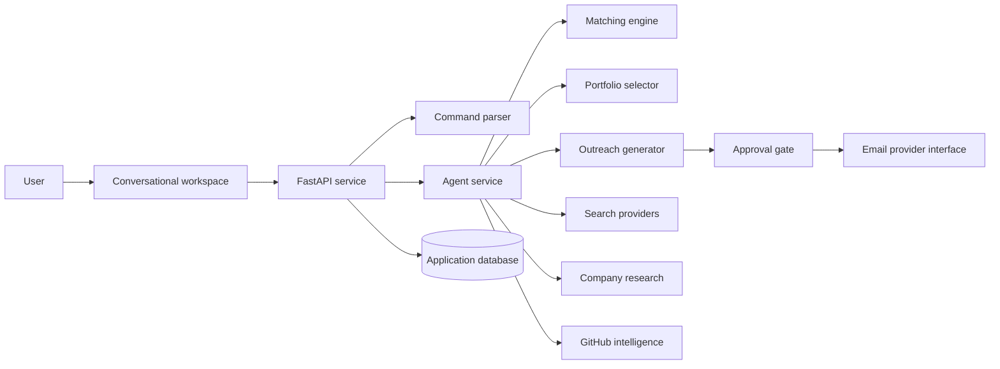

# ApplyPilot AI

### Turn job hunting into a conversation.

ApplyPilot AI is a full-stack conversational workspace for discovering international remote opportunities, understanding role fit, preparing tailored outreach, selecting relevant portfolio evidence, and tracking applications from discovery to reply.

> **Portfolio showcase:** The production source is maintained in a private repository. This public repository documents the product, engineering decisions, and verified demo behavior without distributing the implementation.

## Product experience

Instead of moving between job boards, notes, email drafts, and spreadsheets, a user can simply ask:

```text
Find international remote AI / RAG / Python work today
```

ApplyPilot responds with numbered opportunities, transparent approximate-fit explanations, important matching skills, gaps, remote constraints, and clear next actions.

The user can then write:

```text
apply 1, 2 and 4
```

For each selected role, the system:

1. Evaluates the requirements and company context
2. Selects the most relevant portfolio project
3. Drafts concise, role-specific outreach
4. Shows a complete preview
5. Requires explicit user approval
6. Simulates delivery in demo mode
7. Updates the application tracker

## Highlights

- Chat-first remote opportunity discovery
- Deterministic parsing for numbered commands—no LLM required
- Transparent, explainable fit scoring
- Context-aware portfolio project selection
- Personalized outreach with privacy-safe candidate defaults
- Mandatory approval before any send action
- Kanban application tracker with persistent state
- Responsive light and dark product UI
- Realistic, clearly labeled demo opportunities
- Modular live-provider interfaces with deterministic Demo Mode fallback

## Phase 2: integration-ready product

The private product now includes:

- A strict `awaiting approval → approved → sending → sent` workflow
- Selective approval, duplicate-send prevention, failure history, and retry support
- Real GitHub repository/README synchronization with evidence-quality analysis
- Template-signal detection so keyword-heavy starter repositories do not outrank stronger original work
- Gmail OAuth-ready architecture with safer draft-only delivery as the default
- Manual job and company-outreach opportunities
- Persistent candidate profile and validated PDF resume metadata
- Kanban and table tracking, blocker detection, reply architecture, and integration settings

External services remain visibly **Not connected** until credentials are supplied. Demo Mode continues to work without GitHub, Gmail, job APIs, or an AI key.

## Phase 3: live discovery and outreach

The private product now also supports:

- Saved daily-search profiles, run history, source provenance, normalization, and duplicate detection
- Pluggable live web-search and company-careers discovery with automatic Demo Mode fallback
- Evidence-based company research that clearly separates sourced facts, inferences, and proposed pitches
- Public contact-route discovery with verification and manual-confirmation gates before outreach
- Deeper GitHub portfolio intelligence across languages, topics, feature evidence, originality, and template signals
- Confidence-aware project selection that explicitly reports when there is no strong portfolio match
- OpenAI-compatible generation boundaries with deterministic local behavior when no model is connected
- Gmail OAuth, draft-only mode, controlled sends, and thread-level reply synchronization
- Operational analytics and provider activity/audit history

The production workflow remains human-controlled: finding opportunities can be automated, but outreach cannot be sent until a user reviews and explicitly approves it.

## Technology

| Layer | Stack |
| --- | --- |
| Product UI | Next.js, React, TypeScript, CSS |
| API | FastAPI, Python, Pydantic |
| Persistence | SQLAlchemy, SQLite |
| Quality | Pytest, ESLint, Next.js production build |
| Local delivery | PowerShell launcher, Docker Compose |

## Architecture



The architecture keeps deterministic product logic separate from AI-provider concerns. Search research, proposal generation, GitHub sync, and email delivery can each adopt a real provider without rewriting the core application workflow.

## Matching model

The approximate fit indicator is explainable rather than presented as scientific certainty:

- 40% required-skill overlap
- 20% preferred-skill overlap
- 15% portfolio evidence
- 10% work-type alignment
- 10% remote compatibility
- 5% experience-level fit

Every score includes visible match reasons and missing skills.

## Safety by design

- No automatic outreach without approval
- No fabricated experience, qualifications, projects, or metrics
- No passwords or API secrets in source
- No location or student-status disclosure unless required
- Demo opportunities and simulated email delivery are clearly marked
- No CAPTCHA bypassing or access-restriction circumvention
- Public HTTP(S) extraction only, with private-host, size, content-type, and access-wall rejection
- Verified or manually confirmed recipients for non-demo sends
- Duplicate company, role, and recipient protection plus configurable send limits

## Verified MVP workflow

The end-to-end demo supports:

1. Search for remote AI work
2. Receive eight ranked demo opportunities
3. Select roles by number
4. Generate application drafts
5. Select different project evidence based on role relevance
6. Review and approve each email
7. Simulate sending
8. See the tracker update

Quality checks completed:

- Backend automated tests: **22 passed**
- Frontend lint: **passed**
- Next.js production build: **passed**
- Selective approval and send workflow: **verified locally**
- Demo fallback, selective approval, controlled send, and analytics: **verified locally**
- Live-provider credentials remain optional and are never committed

## Roadmap

- Vendor-specific job-search adapters
- Encrypted production secret storage
- Rich reply classification and assisted response drafting
- Browser-assisted application forms
- Scheduled background searches and notifications
- Multi-user authentication

## Source access

The source code is intentionally private to protect the original implementation. Recruiters or collaborators can request a guided technical walkthrough or temporary review access directly from the author.

© 2026 Muhammad Anas. All rights reserved.
